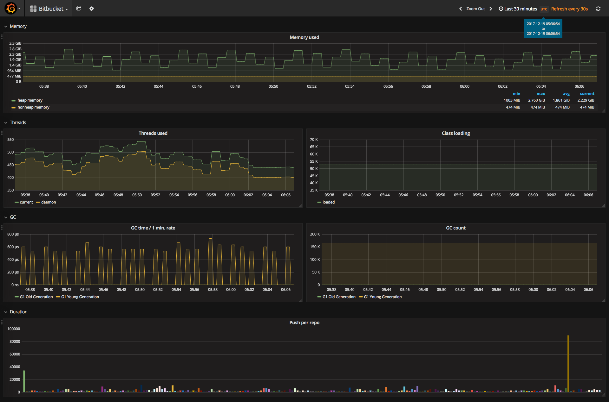

# Prometheus Exporter For Bitbucket

This is Bitbucket plugin which provides endpoint to expose Bitbucket metrics to Prometheus.

For more information the documentation [Prometheus Exporter For Bitbucket](https://github.com/AndreyVMarkelov/prom-bitbucket-exporter/wiki/Prometheus-Exporter-For-Bitbucket).

On Atlassian Marketplace [Prometheus Exporter For Bitbucket](https://marketplace.atlassian.com/plugins/ru.andreymarkelov.atlas.plugins.prom-bitbucket-exporter/server/overview)

## Grafana examples 

* [Example grafana dashborad](./grafana/dashboard-example.json)

